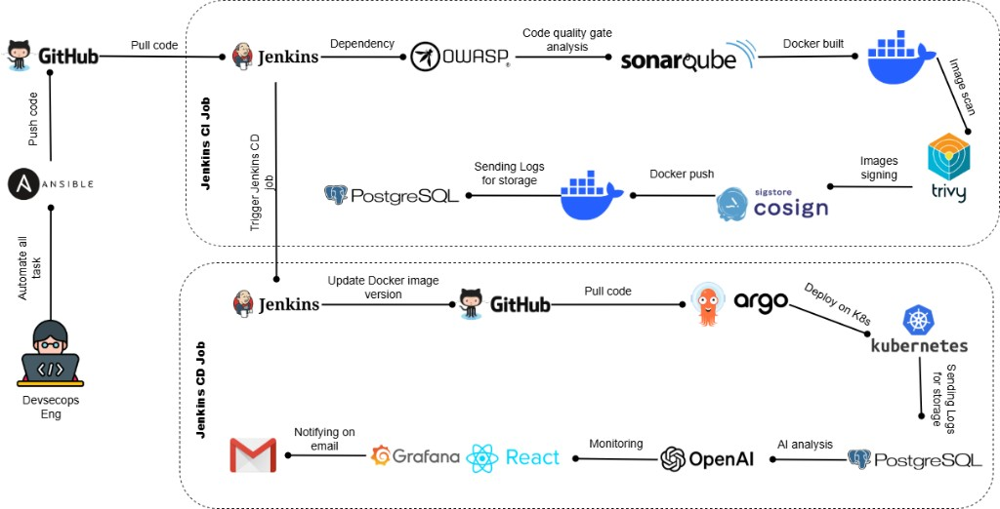

# DevSecOps Project — Simple Shop Pipeline

End-to-end **DevSecOps** lab: a Node.js microservice (**Simple Shop**) is tested, scanned, built, signed, and deployed to Kubernetes with **Jenkins**, **SonarQube**, **OWASP Dependency-Check**, **Gitleaks**, **Trivy**, **Cosign**, **Argo CD**, a **PostgreSQL**-backed **SentinelOps** security dashboard, and a **Hugging Face** AI analyzer.

This README is written so someone who is **not** a DevOps specialist can clone the idea, adapt the IPs/credentials, and stand up their own copy.

---

## Table of contents

1. [What you get](#what-you-get)
2. [Architecture](#architecture)
3. [Lab topology (customize these)](#lab-topology-customize-these)
4. [Repository layout](#repository-layout)
5. [Documentation map](#documentation-map)
6. [Ports & URLs cheat sheet](#ports--urls-cheat-sheet)
7. [Default lab credentials](#default-lab-credentials)
8. [Pipeline stages (what Jenkins does)](#pipeline-stages-what-jenkins-does)
9. [Open Grafana (monitoring)](#open-grafana-monitoring)
10. [Fast path (already have Jenkins + K8s)](#fast-path-already-have-jenkins--k8s)
11. [Where to go next](#where-to-go-next)

---

## What you get

| Piece | Role |
|-------|------|
| `microservice/` | Simple Shop web app (unit-tested, containerized) |
| `Jenkinsfile` | Full CI/CD + security pipeline |
| SonarQube / OWASP / Gitleaks / Trivy / Cosign | SAST, SCA, secrets, image CVE scan, image signing |
| Argo CD + `k8s/` | GitOps deploy of shop, dashboard, and AI |
| PostgreSQL (`jenkins` DB) | Shared store for pipeline logs, findings, users, AI results |
| Ingest bridge `:4200` | Uploads scanner reports into Postgres |
| AI analyzer `:4300` | Hugging Face analysis of stored findings |
| Security dashboard `:4100` / NodePort `30410` | Login UI, findings, pipelines, AI chat |
| Grafana `:3030` + Prometheus | Build + container/K8s CPU/RAM monitoring and email alerts |

---

## Architecture



High-level flow (matches the diagram above):

1. **DevSecOps engineer + Ansible** automate lab setup and push application / infra code to **GitHub**.
2. **Jenkins CI** pulls the code, runs **OWASP** dependency checks, **SonarQube** quality analysis, **Docker** build, **Trivy** image scan, and **Cosign** signing, then pushes the signed image and stores logs in **PostgreSQL**.
3. **Jenkins CD** updates the image version in GitHub; **Argo CD** pulls those manifests and deploys to **Kubernetes**.
4. Deployment / pipeline logs go to **PostgreSQL**; the **AI analyzer** (Hugging Face in this lab) reads findings for analysis; the **React** SentinelOps dashboard and **Grafana Labs** (Prometheus + cAdvisor + Pushgateway) monitor health; Grafana can **email** alerts.

In this repository the CI and CD steps live in a **single** `Jenkinsfile` (one job), AI uses **Hugging Face** rather than OpenAI, and monitoring is provisioned under `monitoring/` (see [docs/GRAFANA_SETUP.md](docs/GRAFANA_SETUP.md)). The diagram still describes the intended architecture end to end.

---

## Lab topology (customize these)

Our reference lab uses these addresses. **Replace them with yours** in `Jenkinsfile`, `k8s/*/configmap.yaml`, `k8s/sentinelops-config.yaml`, and Argo CD.

| Role | Example (this lab) | Notes |
|------|--------------------|-------|
| Jenkins + Postgres + agent tools | `192.168.10.149` | Often same VM as SonarQube / kube access |
| SonarQube UI | `http://192.168.10.149:9000` | Docker container `sonarqube` on the host |
| Argo CD API | `192.168.10.149:30443` | NodePort / ingress to Argo server |
| Optional LAN ingest | `192.168.10.147:4200` | **Do not** set this as Jenkins global `INGEST_URL`; pipeline uses `127.0.0.1:4200` |
| GitHub repo | `https://github.com/vanelnara/DevSecops-Project.git` | Fork and change `GIT_REPO` / Argo `repoURL` |
| Docker Hub org | `sneproject` | Change image names if you use another registry |

Agent-local services (always on the Jenkins node that runs the job):

| Service | URL |
|---------|-----|
| Ingest | `http://127.0.0.1:4200` |
| AI | `http://127.0.0.1:4300` |
| Dashboard API | `http://127.0.0.1:4100` |
| Grafana | `http://127.0.0.1:3030` |
| Prometheus | `http://127.0.0.1:9090` |
| Pushgateway | `http://127.0.0.1:9091` |
| Postgres | `127.0.0.1:5432` DB `jenkins` / user `jenkins` |

---

## Repository layout

```text
.
├── README.md                          ← you are here
├── Jenkinsfile                        ← CI/CD definition
├── sonar-project.properties
├── docker-compose.yml                 ← local Postgres + ingest + AI + dashboard
├── .env.example
├── ansible/                           ← infra provisioning guide + example playbooks
├── monitoring/                        ← Grafana + Prometheus + Pushgateway + cAdvisor
├── docs/                              ← detailed setup guides
│   └── images/devsecops-architecture.png  ← architecture diagram (README)
├── db/migrations/                     ← SQL schema for dashboard / findings
├── k8s/                               ← Simple Shop + shared ConfigMap + Argo app
│   ├── dashboard/                     ← SentinelOps dashboard K8s + Argo app
│   └── ai-analyzer/                   ← AI service K8s + Argo app
├── microservice/                      ← Simple Shop application
├── security-dashboard/                ← React + Express UI
├── services/
│   ├── ingest-bridge/                 ← report → Postgres
│   └── ai-analyzer/                   ← Hugging Face analysis
├── scripts/                           ← ensure-*, publish, migrations, etc.
├── security/                          ← gitleaks / OWASP suppressions
└── vars/                              ← credential checklists (examples only)
```

---

## Documentation map

| Document | Audience | Contents |
|----------|----------|----------|
| **[ansible/README.md](ansible/README.md)** | First-time lab builders | Hosts, packages, Ansible inventory/playbooks **or** matching manual steps |
| **[docs/SETUP_GUIDE.md](docs/SETUP_GUIDE.md)** | Everyone | Full procedure from empty VMs to green pipeline |
| **[docs/JENKINS_SETUP.md](docs/JENKINS_SETUP.md)** | Jenkins admins | Plugins, tools on the agent, credentials, SonarQube, job creation |
| **[docs/GRAFANA_SETUP.md](docs/GRAFANA_SETUP.md)** | Operators | Grafana Labs, Prometheus, email alerts, Jenkins metrics stage |
| **[docs/JENKINS_DASHBOARD_SETUP.md](docs/JENKINS_DASHBOARD_SETUP.md)** | Operators | Ingest / AI / dashboard stages and DB password / HF key |
| **[docs/SECURITY_DASHBOARD_BACKEND.md](docs/SECURITY_DASHBOARD_BACKEND.md)** | Developers | Data plane (ingest → Postgres → AI → UI) |
| **[docs/COSIGN.md](docs/COSIGN.md)** | Security | Cosign keypair and Jenkins secret IDs |
| **[security-dashboard/README.md](security-dashboard/README.md)** | Frontend | Local dashboard API routes |
| **[docs/GITLEAKS.md](docs/GITLEAKS.md)** | Security | Historical leak fingerprints + rotate checklist |
| **[vars/credentials.yml.example](vars/credentials.yml.example)** | Checklist | Every secret you will paste into Jenkins (never commit real values) |

---

## Ports & URLs cheat sheet

| Service | Port | How you reach it |
|---------|------|------------------|
| Simple Shop | **30081** | `http://<any-worker-ip>:30081` |
| Security dashboard | **30410** (K8s) / **4100** (Jenkins host) | `http://<node>:30410` or `http://<jenkins>:4100` |
| AI analyzer | **30430** (K8s) / **4300** (Jenkins host) | Health: `/health` |
| Ingest bridge | **4200** | Jenkins agent only (`127.0.0.1`) |
| Grafana | **3030** | `http://<jenkins-ip>:3030` |
| Prometheus | **9090** | `http://<jenkins-ip>:9090` |
| Pushgateway | **9091** | Receives pipeline metrics |
| Argo CD | **30443** | `https://<argo-host>:30443` |
| SonarQube | **9000** | `http://<sonar-host>:9000` |
| PostgreSQL | **5432** | Host / Jenkins agent |
| Dashboard Vite (dev only) | **5173** | Local `npm run dev` |

---

## Default lab credentials

**Lab only — change immediately in any shared or production-like environment.**

| System | Username | Password / secret |
|--------|----------|-------------------|
| SentinelOps dashboard | `admin` | `admin` (change in **Settings**) |
| Grafana | `admin` | `admin` (or `GRAFANA_ADMIN_PASSWORD` in `monitoring/.env`) |
| Postgres (compose / local examples) | `jenkins` | `jenkins` (or your real password in Jenkins credential `jenkins-db-password`) |
| Argo CD | `admin` | From `argocd-initial-admin-secret` (store in Jenkins as `argocd-admin-password`) |
| SonarQube | (your user) | Token → Jenkins `sonarqube-token` |
| Grafana email alerts | — | Gmail App Password in `monitoring/.env` → `GF_SMTP_PASSWORD` (alerts to `naravanel31@gmail.com`) |

---

## Pipeline stages (what Jenkins does)

1. **Checkout** — clone `main`
2. **Unit Tests** — `microservice` `npm ci` + `npm test`
3. **SAST - SonarQube** — project key `devsecops-simple-shop`
4. **Dependency Scan - OWASP** — NVD API via `nvd-api-key`
5. **Secret Detection - Gitleaks**
6. **Docker Build & Push** — shop + dashboard + AI images tagged with `BUILD_NUMBER` and `latest`
7. **Container Scan - Trivy**
8. **Image Signing - Cosign**
9. **Deploy to Kubernetes** — Argo CD sync (kubectl fallback) for shop, dashboard, AI
10. **Start Security Services** — host ingest `:4200` + AI `:4300` (+ optional full stack)
11. **Store Security Findings** — publish reports into Postgres
12. **AI Security Analysis** — Hugging Face analysis for that build
13. **Publish Metrics to Grafana** — `scripts/ensure-monitoring.sh` + `scripts/publish-metrics-to-grafana.sh` (build metrics → Pushgateway; CPU/RAM via cAdvisor)

Artifacts under `reports/` are archived on every build.

---

## Open Grafana (monitoring)

### How to open it in the browser

| Where you browse from | URL |
|-----------------------|-----|
| On the Jenkins server itself | [http://127.0.0.1:3030](http://127.0.0.1:3030) |
| From your PC (this lab) | [http://192.168.10.149:3030](http://192.168.10.149:3030) |
| Your own host | `http://<jenkins-ip>:3030` |

1. Open the URL above.  
2. Login: **`admin` / `admin`** (change via `GRAFANA_ADMIN_PASSWORD` in `monitoring/.env`).  
3. Left menu → **Dashboards** → folder **DevSecOps** → **DevSecOps overview**.  
4. After a Jenkins build you should see **Latest build result** (`SUCCESS` / `FAILED` / `UNSTABLE`), build number, duration, risk, findings, trends, and container CPU/RAM.  
5. If an old dashboard still says FAILED after a green build, clear legacy Pushgateway data once:

```bash
curl -X DELETE http://127.0.0.1:9091/metrics/job/jenkins_pipeline || true
docker compose -f monitoring/docker-compose.yml --env-file monitoring/.env up -d
```

Related UIs:

- Prometheus: `http://<jenkins-ip>:9090`  
- Pushgateway: `http://<jenkins-ip>:9091`  

### Start Grafana the first time (on the Jenkins host)

```bash
cd /path/to/DevSecops-Project

cp monitoring/.env.example monitoring/.env
# Optional: set GRAFANA_ADMIN_PASSWORD, GF_SMTP_PASSWORD (Gmail App Password),
#           GRAFANA_ROOT_URL=http://192.168.10.149:3030

docker compose -f monitoring/docker-compose.yml --env-file monitoring/.env up -d

# Or let the helper do it:
chmod +x scripts/ensure-monitoring.sh
scripts/ensure-monitoring.sh

curl -sS http://127.0.0.1:3030/api/health
```

Optional Kubernetes node CPU/RAM exporters:

```bash
kubectl apply -k k8s/monitoring/
```

Ansible (same stack on the Jenkins inventory host):

```bash
cd ansible
ansible-playbook -i inventory/hosts.yml playbooks/04-grafana.yml
```

Full detail (SMTP email alerts, Jenkins Prometheus plugin, troubleshooting): **[docs/GRAFANA_SETUP.md](docs/GRAFANA_SETUP.md)**.

---

## Fast path (already have Jenkins + K8s)

1. Fork/clone this repo; update GitHub URL, Docker Hub org, and lab IPs.
2. Copy `vars/credentials.yml.example` → fill privately → create **every** Jenkins credential with the **exact IDs** in [docs/JENKINS_SETUP.md](docs/JENKINS_SETUP.md).
3. Apply DB migrations: `scripts/apply-db-migrations.sh` (or see SETUP_GUIDE).
4. Create SonarQube project `devsecops-simple-shop` and point Jenkins Sonar installer name to `sonarqube-server`.
5. Apply / sync Argo apps under `k8s/`, `k8s/dashboard/`, `k8s/ai-analyzer/`.
6. Start monitoring once: `scripts/ensure-monitoring.sh` (or the `docker compose` commands above).
7. Create a Pipeline job pointing at this `Jenkinsfile` and run it.
8. Open SentinelOps (`:4100` or NodePort `30410`), login `admin` / `admin`.
9. Open Grafana at **`http://<jenkins-ip>:3030`** → **DevSecOps overview**.

If **Store Findings** or **AI Analysis** fails with *Connection refused* on `:4200` / `:4300`, the agent scripts `scripts/ensure-ingest.sh` and `scripts/ensure-ai.sh` start those services on the Jenkins node (they need `JENKINS_DB_PASSWORD` and Node/npm).

---

## Where to go next

1. **[ansible/README.md](ansible/README.md)** — prepare VMs (Ansible or manual).  
2. **[docs/SETUP_GUIDE.md](docs/SETUP_GUIDE.md)** — end-to-end checklist.  
3. **[docs/JENKINS_SETUP.md](docs/JENKINS_SETUP.md)** — plugins, SonarQube, credentials, job.  
4. **[docs/GRAFANA_SETUP.md](docs/GRAFANA_SETUP.md)** — Grafana, Prometheus, email alerts.  

Questions about Cosign keys → [docs/COSIGN.md](docs/COSIGN.md).  
Questions about dashboard data → [docs/SECURITY_DASHBOARD_BACKEND.md](docs/SECURITY_DASHBOARD_BACKEND.md).
