# SentinelOps — Cloud-Native DevSecOps Delivery Platform

> **Shift-left security · Jenkins CI/CD · GitOps on Kubernetes · AI-assisted triage · Observability**

A production-style **DevSecOps** platform that takes a Node.js microservice (**Simple Shop**) from commit to Kubernetes with automated testing, SAST/SCA/secrets/image scanning, image signing, GitOps deploy, a **PostgreSQL**-backed **SentinelOps** security dashboard, **Hugging Face** AI analysis, and **Grafana Labs** monitoring.

Built to demonstrate the skills hiring managers look for in a **DevSecOps / Platform Security Engineer**: pipeline design, supply-chain controls, GitOps, Kubernetes operations, security tooling integration, and security-aware observability.

| Capability | What this repo shows |
|------------|----------------------|
| **CI/CD** | Full `Jenkinsfile` — test → scan → build → sign → deploy → ingest → AI → metrics |
| **Shift-left security** | SonarQube, OWASP Dependency-Check, Gitleaks, Trivy, Cosign |
| **GitOps** | Argo CD apps for shop, dashboard, and AI analyzer |
| **Security product UI** | SentinelOps (React) — findings, pipelines, AI copilot |
| **AI triage** | Hugging Face analyzer on stored findings |
| **Observability** | Grafana + Prometheus + Pushgateway + cAdvisor (pipeline auto-heals core stack) |
| **IaC / day-0** | Ansible playbooks + deep-dive docs |

This guide is written so another engineer can **follow the screens**, adapt IPs/credentials, and stand up their own copy.

---

## Table of contents

1. [What you get](#what-you-get)
2. [Architecture](#architecture)
3. [Lab topology (customize these)](#lab-topology-customize-these)
4. [Visual walkthrough](#visual-walkthrough)
   - [Step 1 — Clone the repository](#step-1--clone-the-repository)
   - [Step 2 — Provision with Ansible](#step-2--provision-with-ansible)
   - [Step 3 — Jenkins home & job](#step-3--jenkins-home--job)
   - [Step 4 — SonarQube project](#step-4--sonarqube-project)
   - [Step 5 — Run the pipeline](#step-5--run-the-pipeline)
   - [Step 6 — Security scan results](#step-6--security-scan-results)
   - [Step 7 — Argo CD & Kubernetes](#step-7--argo-cd--kubernetes)
   - [Step 8 — Simple Shop application](#step-8--simple-shop-application)
   - [Step 9 — SentinelOps security dashboard](#step-9--sentinelops-security-dashboard)
   - [Step 10 — Grafana & Prometheus](#step-10--grafana--prometheus)
5. [Repository layout](#repository-layout)
6. [Documentation map](#documentation-map)
7. [Ports & URLs cheat sheet](#ports--urls-cheat-sheet)
8. [Default lab credentials](#default-lab-credentials)
9. [Pipeline stages (what Jenkins does)](#pipeline-stages-what-jenkins-does)
10. [Open Grafana (monitoring)](#open-grafana-monitoring)
11. [Fast path (already have Jenkins + K8s)](#fast-path-already-have-jenkins--k8s)
12. [Where to go next](#where-to-go-next)
13. [Closing notes](#closing-notes)

---

## What you get

| Piece | Role |
|-------|------|
| `microservice/` | Simple Shop web app (unit-tested, containerized) |
| `Jenkinsfile` | Full CI/CD + security pipeline |
| SonarQube / OWASP / Gitleaks / Trivy / Cosign | SAST, SCA, secrets, image CVE scan, image signing |
| Argo CD + `k8s/` | GitOps deploy of shop, dashboard, and AI |
| PostgreSQL (`jenkins` DB) | Shared store for pipeline logs, findings, users, AI results |
| Ingest bridge `:4200` | Uploads scanner reports into Postgres |
| AI analyzer `:4300` | Hugging Face analysis of stored findings |
| Security dashboard `:4100` / NodePort `30410` | Login UI, findings, pipelines, AI chat |
| Grafana `:3030` + Prometheus | Build + container monitoring; pipeline auto-starts the stack |

---

## Architecture


High-level flow (matches the diagram above):

1. **DevSecOps engineer + Ansible** automate lab setup and push application / infra code to **GitHub**.
2. **Jenkins CI** pulls the code, runs **OWASP** dependency checks, **SonarQube** quality analysis, **Docker** build, **Trivy** image scan, and **Cosign** signing, then pushes the signed image and stores logs in **PostgreSQL**.
3. **Jenkins CD** updates the image version in GitHub; **Argo CD** pulls those manifests and deploys to **Kubernetes**.
4. Deployment / pipeline logs go to **PostgreSQL**; the **AI analyzer** (Hugging Face) reads findings; the **React** SentinelOps dashboard and **Grafana Labs** (Prometheus + cAdvisor + Pushgateway) monitor health; Grafana can **email** alerts.

In this repository the CI and CD steps live in a **single** `Jenkinsfile` (one job). Monitoring under `monitoring/` is started by the pipeline via `scripts/ensure-monitoring.sh` (see [docs/GRAFANA_SETUP.md](docs/GRAFANA_SETUP.md)).

---

## Lab topology (customize these)

Our reference lab uses these addresses. **Replace them with yours** in `Jenkinsfile`, `k8s/*/configmap.yaml`, `k8s/sentinelops-config.yaml`, and Argo CD.

| Role | Example (this lab) | Notes |
|------|--------------------|-------|
| Jenkins + Postgres + agent tools | `192.168.10.149` | Often same VM as SonarQube / kube access |
| SonarQube UI | `http://192.168.10.149:9000` | Docker container `sonarqube` on the host |
| Argo CD API | `192.168.10.149:30443` | NodePort / ingress to Argo server |
| Optional LAN ingest | `192.168.10.147:4200` | **Do not** set this as Jenkins global `INGEST_URL`; pipeline uses `127.0.0.1:4200` |
| GitHub repo | `https://github.com/vanelnara/DevSecops-Project.git` | Fork and change `GIT_REPO` / Argo `repoURL` |
| Docker Hub org | `sneproject` | Change image names if you use another registry |

Agent-local services (always on the Jenkins node that runs the job):

| Service | URL |
|---------|-----|
| Ingest | `http://127.0.0.1:4200` |
| AI | `http://127.0.0.1:4300` |
| Dashboard API | `http://127.0.0.1:4100` |
| Grafana | `http://127.0.0.1:3030` |
| Prometheus | `http://127.0.0.1:9090` |
| Pushgateway | `http://127.0.0.1:9091` |
| Postgres | `127.0.0.1:5432` DB `jenkins` / user `jenkins` |

---

## Visual walkthrough

Follow these steps in order the first time you build the lab. Each step shows **what to do**, **what success looks like**, and a live screenshot from this lab.

**Before you start**, confirm you have: Linux VMs with SSH/sudo, a GitHub fork of this repo, a container registry (e.g. Docker Hub), and optionally Ansible 2.14+ on your control node.

---

### Step 1 — Clone the repository

```bash
git clone https://github.com/vanelnara/DevSecops-Project.git
cd DevSecops-Project
```

Fork first if you will push your own IPs and image names. Update `GIT_REPO`, Docker Hub org, and lab IPs as described in [docs/SETUP_GUIDE.md](docs/SETUP_GUIDE.md).

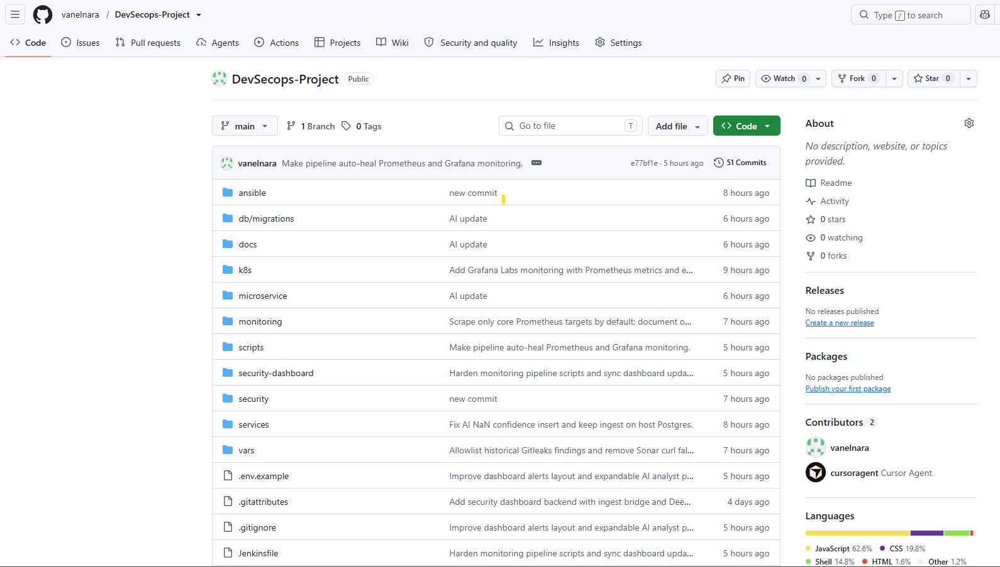

*Caption: The project repository on GitHub — README, `Jenkinsfile`, and folders visible.*

---

### Step 2 — Provision with Ansible

Provision day-0 tools on the Jenkins (and related) hosts. Full inventory notes: **[ansible/README.md](ansible/README.md)**.

```bash
cd ansible
cp inventory/hosts.yml.example inventory/hosts.yml
cp group_vars/all.yml.example group_vars/all.yml
# edit IPs and SSH users — never commit real passwords

ansible all -i inventory/hosts.yml -m ping
ansible-playbook -i inventory/hosts.yml playbooks/site.yml
```

**Success:** `ping` returns `pong` for every host; the site playbook finishes with `failed=0`.

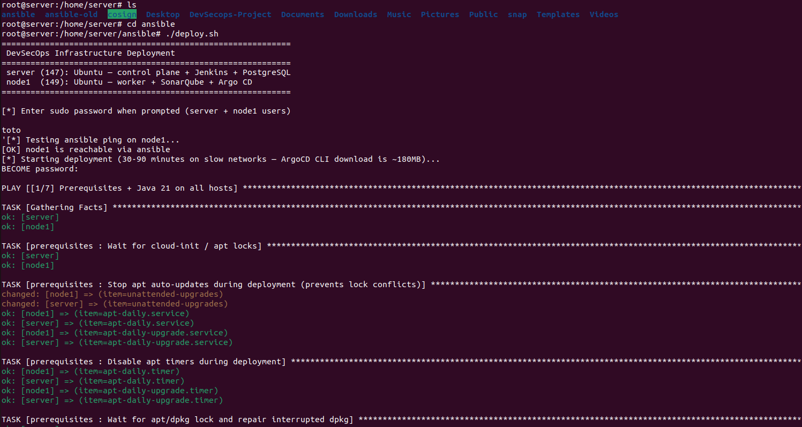

*Caption: `ansible … -m ping` — all hosts green / SUCCESS.*

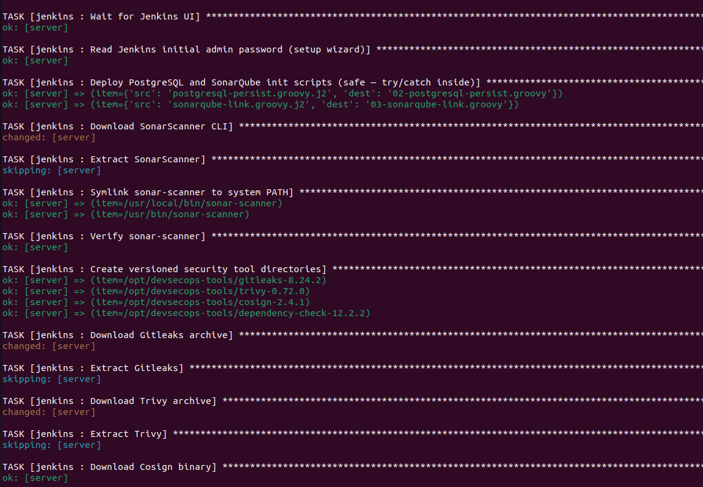

*Caption: `ansible-playbook` completed successfully (`failed=0`).*

Prefer manual installs? Use the same checklist in [ansible/README.md](ansible/README.md) §5 without Ansible.

---

### Step 3 — Jenkins home & job

1. Open Jenkins: `http://<jenkins-ip>:8080`  
2. Install plugins and credentials listed in **[docs/JENKINS_SETUP.md](docs/JENKINS_SETUP.md)** (IDs must match exactly).  
3. Create a **Pipeline** job that loads `Jenkinsfile` from this repo’s `main` branch.  

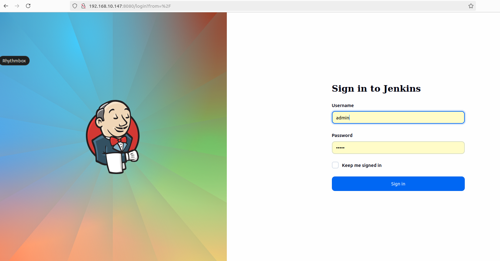

*Caption: Jenkins home — controller is online.*

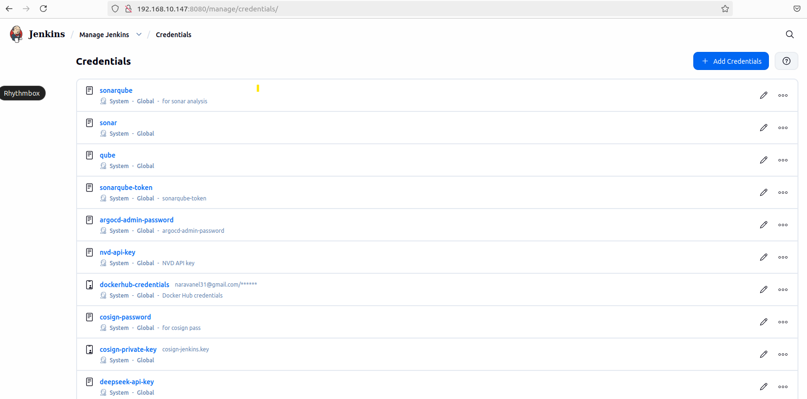

*Caption: Manage Jenkins → Credentials — required secret IDs present (blur secrets in public forks).*

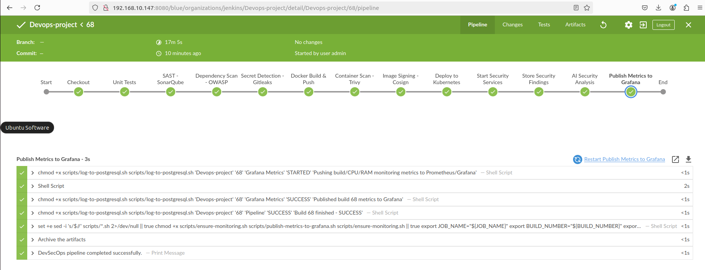

*Caption: Pipeline job pointing at this GitHub repo and `Jenkinsfile`.*

---

### Step 4 — SonarQube project

1. Open SonarQube: `http://<sonar-host>:9000`  
2. Create project key **`devsecops-simple-shop`**.  
3. Generate an analysis token → store in Jenkins as `sonarqube-token`.  
4. In Jenkins system config, SonarQube server name must be exactly **`sonarqube-server`**.  

Details: **[docs/SONARQUBE.md](docs/SONARQUBE.md)**.

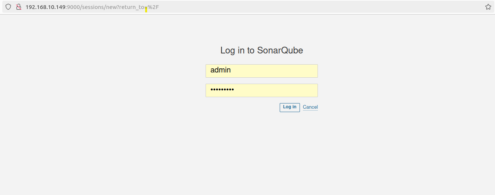

*Caption: SonarQube UI with project `devsecops-simple-shop`.*

---

### Step 5 — Run the pipeline

1. Open the Jenkins job → **Build Now**.  
2. Open the build → **Pipeline** / stage view.  
3. Wait until stages complete (or investigate the first red stage).  

A healthy run reaches **Publish Metrics to Grafana**. That stage calls `scripts/ensure-monitoring.sh`, which starts Grafana / Prometheus / Pushgateway / cAdvisor if needed and publishes build metrics — **no separate manual refresh is required** for the core monitoring stack.

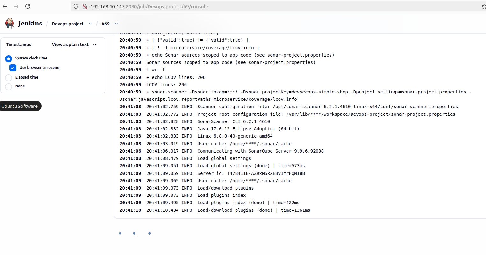

*Caption: Pipeline in progress — stages lighting up.*

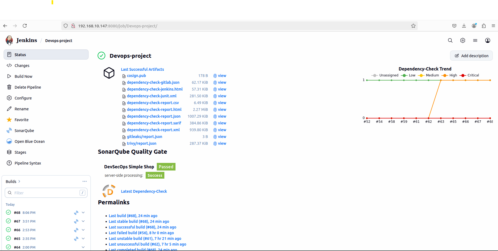

*Caption: Full pipeline finished successfully (or UNSTABLE only on soft AI/quality issues).*

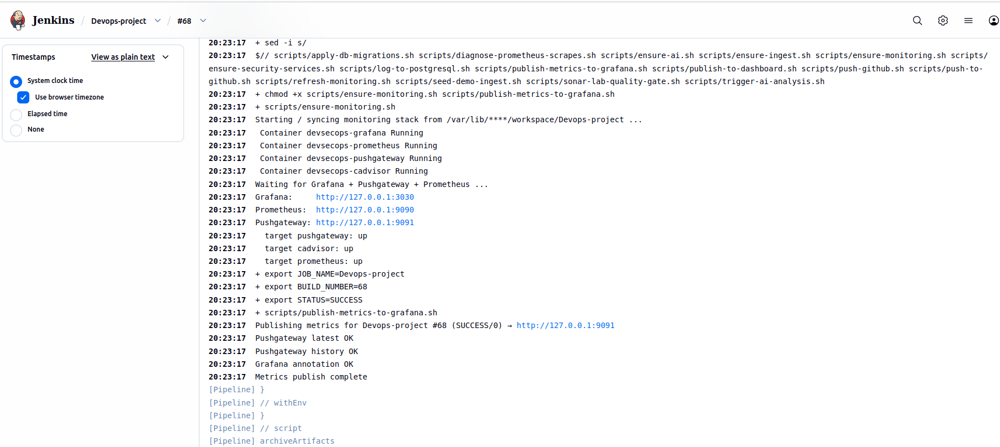

*Caption: Console text from **Publish Metrics to Grafana** — monitoring healthy and metrics published.*

---

### Step 6 — Security scan results

After a green (or mostly green) build, review scanner outputs:

| Tool | Where to look |
|------|----------------|
| SonarQube | Project overview / issues / coverage |
| OWASP | Archived `reports/` + console |
| Gitleaks | Console + allowlist docs |
| Trivy | Image scan report in build artifacts |
| Cosign | Signing lines in console |

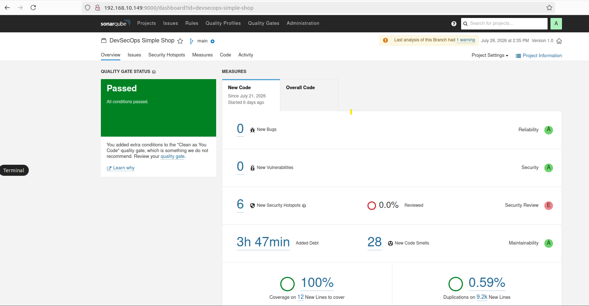

*Caption: Latest analysis for `devsecops-simple-shop` after the pipeline SAST stage.*

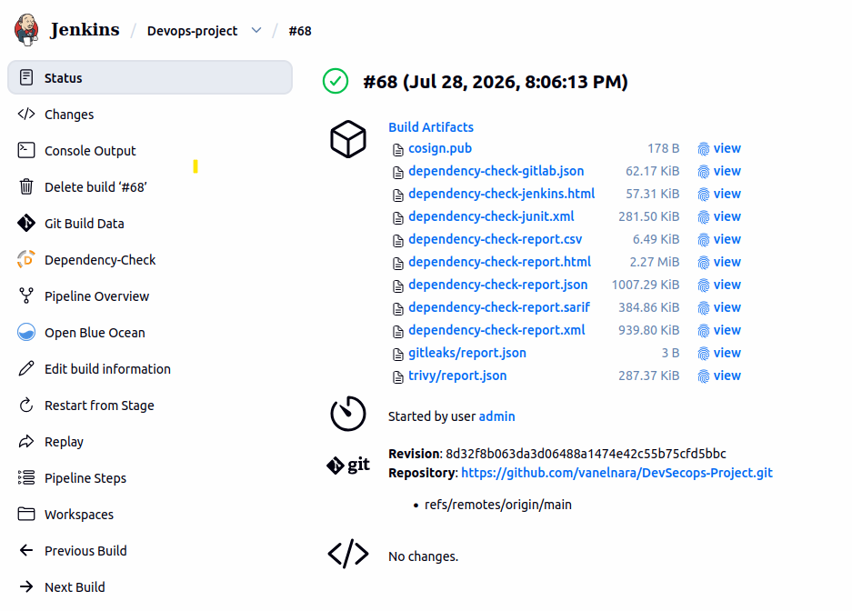

*Caption: Jenkins build → archived `reports/**` (OWASP, Trivy, and related scanner outputs).*

---

### Step 7 — Argo CD & Kubernetes

1. Open Argo CD: `https://<argo-host>:30443`  
2. Confirm applications for Simple Shop, SentinelOps dashboard, and AI analyzer are **Synced / Healthy**.  
3. Optional: inspect cluster workloads with `kubectl` (deployments, services, pods — not only pods).  

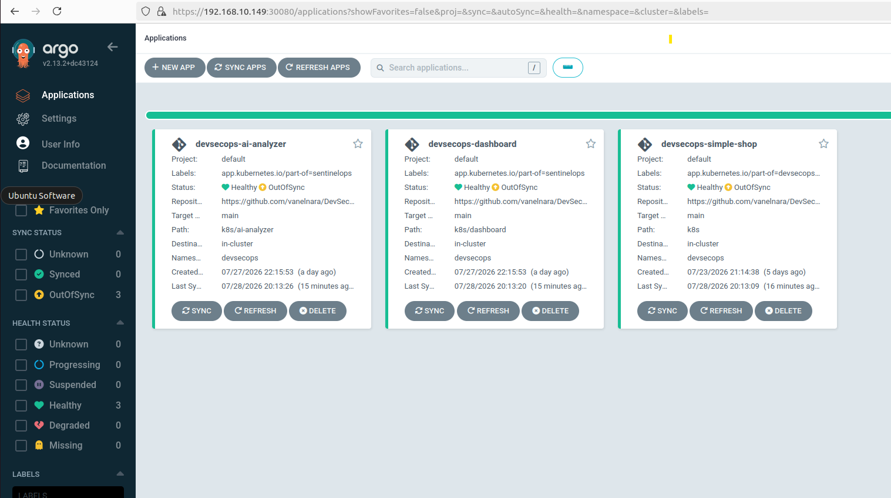

*Caption: Argo CD UI — shop, dashboard, and AI apps Synced and Healthy.*

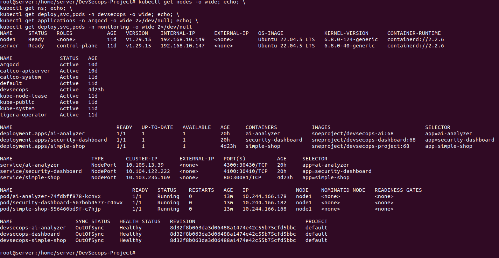

*Caption: Cluster view showing running workloads for the DevSecOps apps.*

---

### Step 8 — Simple Shop application

Open the shop NodePort:

```text
http://<any-worker-or-node-ip>:30081
```

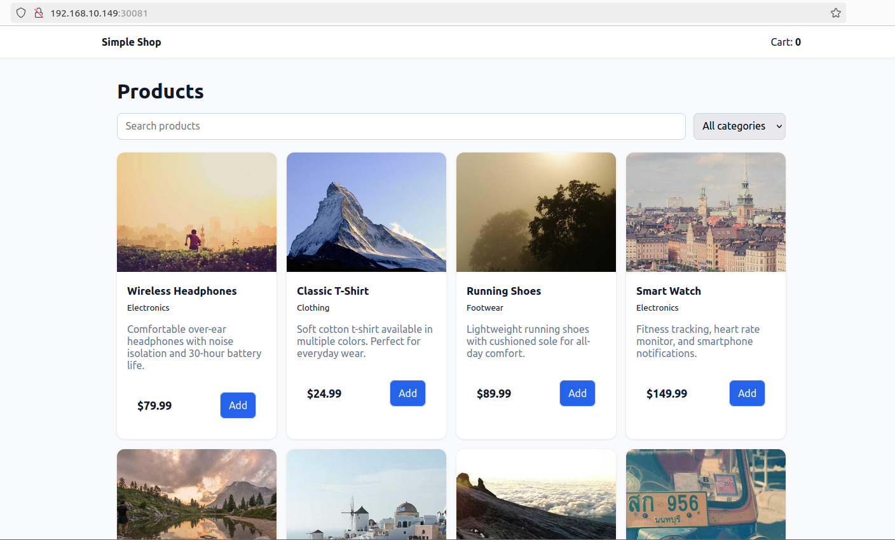

*Caption: Simple Shop running on Kubernetes — application home page.*

---

### Step 9 — SentinelOps security dashboard

| Access | URL |
|--------|-----|
| Jenkins host API/UI | `http://<jenkins-ip>:4100` |
| Kubernetes NodePort | `http://<node-ip>:30410` |

1. Login with lab defaults **`admin` / `admin`**.  
2. On first login you may be asked to **set a new password** — do that, then continue.  
3. Explore **Overview** (metrics, priority alerts, AI analyst), **Findings**, **Pipelines**, and **Security Copilot**.  

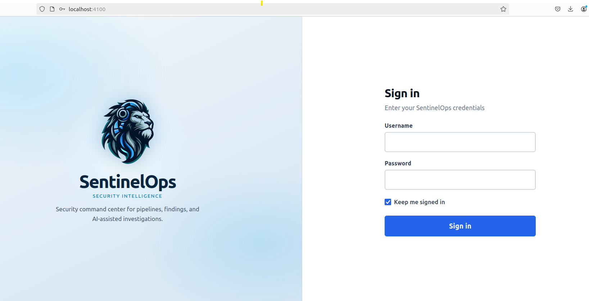

*Caption: SentinelOps login — brand on the left, credentials form on the right.*

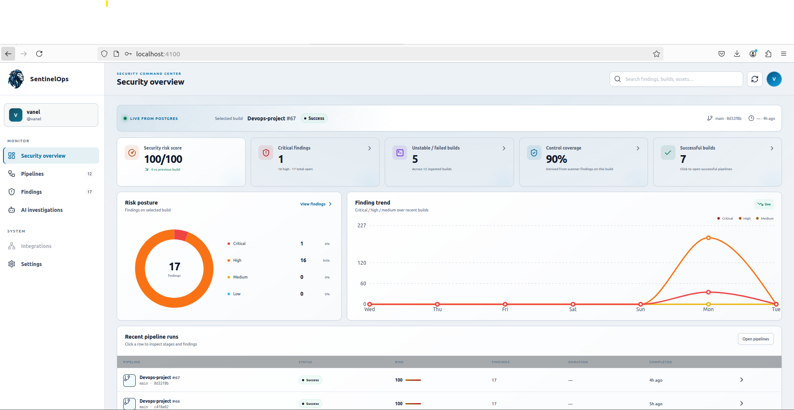

*Caption: Security overview — successful builds, finding trend, priority alerts, AI analyst.*

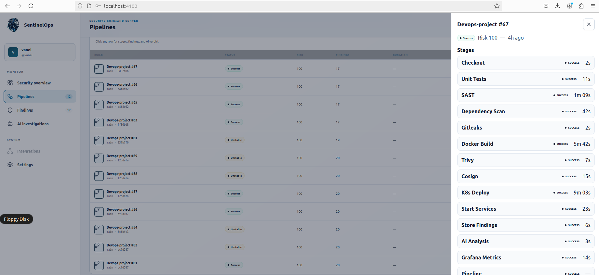

*Caption: Findings / pipelines view populated after ingest.*

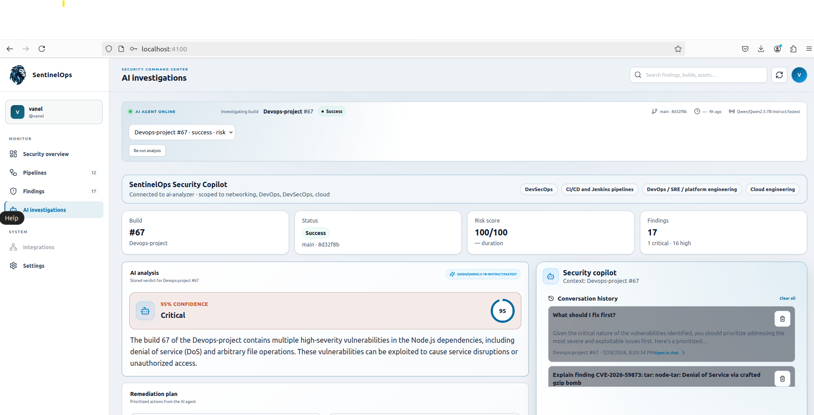

*Caption: AI Security Copilot / analyst with a stored verdict or chat history.*

---

### Step 10 — Grafana & Prometheus

| UI | URL |
|----|-----|
| Grafana | `http://<jenkins-ip>:3030` |
| Prometheus | `http://<jenkins-ip>:9090` |
| Pushgateway | `http://<jenkins-ip>:9091` |

1. Login Grafana: **`admin` / `admin`** (or your `GRAFANA_ADMIN_PASSWORD`).  
2. **Dashboards → DevSecOps → DevSecOps overview**.  
3. Confirm latest build result, trends, and container metrics.  
4. In Prometheus → **Status → Targets**, core jobs should be **UP**: `pushgateway`, `cadvisor`, `prometheus`.  

Optional Jenkins `/prometheus` and Kubernetes exporter scrapes are documented in [docs/GRAFANA_SETUP.md](docs/GRAFANA_SETUP.md); they are **not** required for pipeline panels.

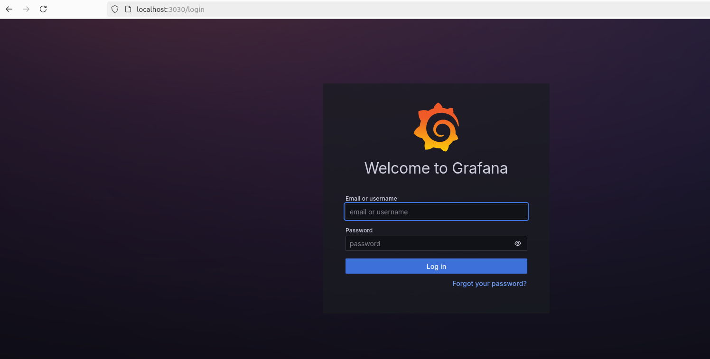

*Caption: Grafana login page.*

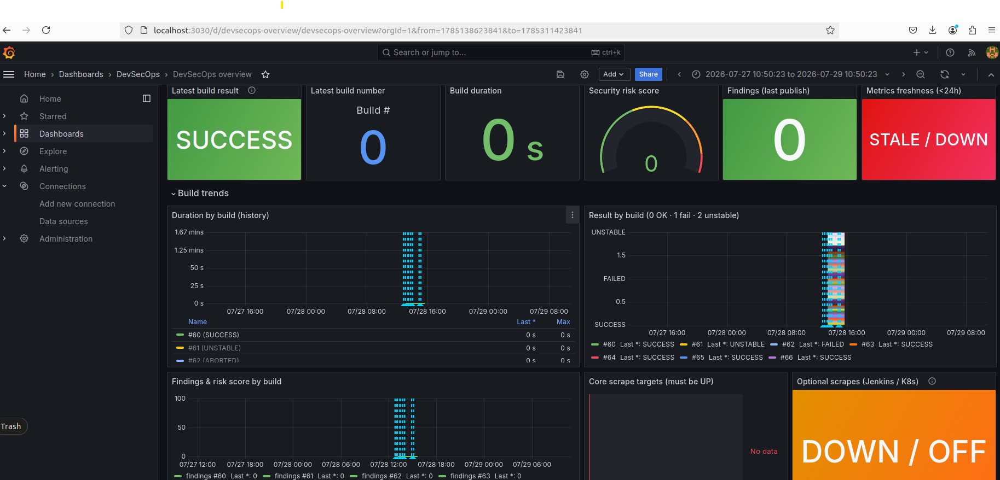

*Caption: DevSecOps overview — latest build, duration, findings, CPU/RAM.*

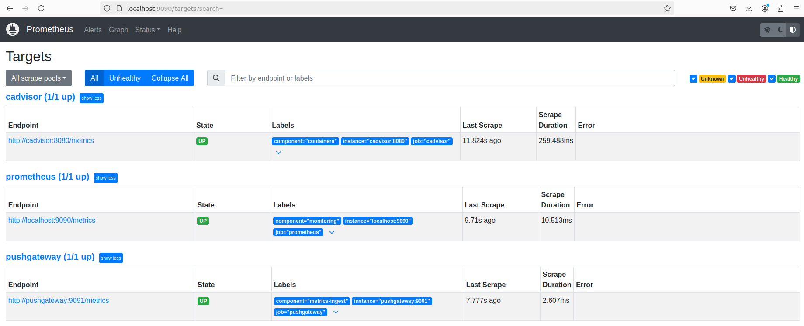

*Caption: Prometheus → Status → Targets — pushgateway, cadvisor, prometheus UP.*

---

## Repository layout

```text
.
├── README.md                          ← you are here
├── Jenkinsfile                        ← CI/CD definition
├── sonar-project.properties
├── docker-compose.yml                 ← local Postgres + ingest + AI + dashboard
├── .env.example
├── ansible/                           ← infra provisioning guide + example playbooks
├── monitoring/                        ← Grafana + Prometheus + Pushgateway + cAdvisor
├── docs/                              ← detailed setup guides
│   ├── images/
│   │   ├── devsecops-architecture.png ← architecture diagram (kept)
│   │   └── guide/                     ← walkthrough screenshots
│   └── *.md                           ← deep-dive guides
├── db/migrations/                     ← SQL schema for dashboard / findings
├── k8s/                               ← Simple Shop + shared ConfigMap + Argo app
│   ├── dashboard/                     ← SentinelOps dashboard K8s + Argo app
│   ├── ai-analyzer/                   ← AI service K8s + Argo app
│   └── monitoring/                    ← optional K8s exporters
├── microservice/                      ← Simple Shop application
├── security-dashboard/                ← React + Express UI (SentinelOps)
├── services/
│   ├── ingest-bridge/                 ← report → Postgres
│   └── ai-analyzer/                   ← Hugging Face analysis
├── scripts/                           ← ensure-*, publish, migrations, diagnose, etc.
├── security/                          ← gitleaks / OWASP suppressions
└── vars/                              ← credential checklists (examples only)
```

---

## Documentation map

| Document | Audience | Contents |
|----------|----------|----------|
| **[ansible/README.md](ansible/README.md)** | First-time lab builders | Hosts, packages, Ansible inventory/playbooks **or** matching manual steps |
| **[docs/SETUP_GUIDE.md](docs/SETUP_GUIDE.md)** | Everyone | Full procedure from empty VMs to green pipeline |
| **[docs/JENKINS_SETUP.md](docs/JENKINS_SETUP.md)** | Jenkins admins | Plugins, tools on the agent, credentials, SonarQube, job creation |
| **[docs/GRAFANA_SETUP.md](docs/GRAFANA_SETUP.md)** | Operators | Grafana Labs, Prometheus, email alerts, optional scrapes |
| **[docs/JENKINS_DASHBOARD_SETUP.md](docs/JENKINS_DASHBOARD_SETUP.md)** | Operators | Ingest / AI / dashboard stages and DB password / HF key |
| **[docs/SECURITY_DASHBOARD_BACKEND.md](docs/SECURITY_DASHBOARD_BACKEND.md)** | Developers | Data plane (ingest → Postgres → AI → UI) |
| **[docs/COSIGN.md](docs/COSIGN.md)** | Security | Cosign keypair and Jenkins secret IDs |
| **[security-dashboard/README.md](security-dashboard/README.md)** | Frontend | Local dashboard API routes |
| **[docs/SONARQUBE.md](docs/SONARQUBE.md)** | Sonar admins | Sources, LCOV coverage, Quality Gate notes |
| **[docs/GITLEAKS.md](docs/GITLEAKS.md)** | Security | Historical leak fingerprints + rotate checklist |
| **[vars/credentials.yml.example](vars/credentials.yml.example)** | Checklist | Every secret you will paste into Jenkins (never commit real values) |

---

## Ports & URLs cheat sheet

| Service | Port | How you reach it |
|---------|------|------------------|
| Simple Shop | **30081** | `http://<any-worker-ip>:30081` |
| Security dashboard | **30410** (K8s) / **4100** (Jenkins host) | `http://<node>:30410` or `http://<jenkins>:4100` |
| AI analyzer | **30430** (K8s) / **4300** (Jenkins host) | Health: `/health` |
| Ingest bridge | **4200** | Jenkins agent only (`127.0.0.1`) |
| Grafana | **3030** | `http://<jenkins-ip>:3030` |
| Prometheus | **9090** | `http://<jenkins-ip>:9090` |
| Pushgateway | **9091** | Receives pipeline metrics |
| Argo CD | **30443** | `https://<argo-host>:30443` |
| SonarQube | **9000** | `http://<sonar-host>:9000` |
| PostgreSQL | **5432** | Host / Jenkins agent |
| Dashboard Vite (dev only) | **5173** | Local `npm run dev` |

---

## Default lab credentials

**Lab only — change immediately in any shared or production-like environment.**

| System | Username | Password / secret |
|--------|----------|-------------------|
| SentinelOps dashboard | `admin` | `admin` (forced change on first login; then Settings) |
| Grafana | `admin` | `admin` (or `GRAFANA_ADMIN_PASSWORD` in `monitoring/.env`) |
| Postgres (compose / local examples) | `jenkins` | `jenkins` (or your real password in Jenkins credential `jenkins-db-password`) |
| Argo CD | `admin` | From `argocd-initial-admin-secret` (store in Jenkins as `argocd-admin-password`) |
| SonarQube | (your user) | Token → Jenkins `sonarqube-token` |
| Grafana email alerts | — | Gmail App Password in `monitoring/.env` → `GF_SMTP_PASSWORD` |

**Before publishing screenshots:** blur tokens, passwords, private keys, and personal emails.

---

## Pipeline stages (what Jenkins does)

1. **Checkout** — clone `main`  
2. **Unit Tests** — `microservice` `npm ci` + `npm test`  
3. **SAST - SonarQube** — project key `devsecops-simple-shop`  
4. **Dependency Scan - OWASP** — NVD API via `nvd-api-key`  
5. **Secret Detection - Gitleaks**  
6. **Docker Build & Push** — shop + dashboard + AI images tagged with `BUILD_NUMBER` and `latest`  
7. **Container Scan - Trivy**  
8. **Image Signing - Cosign**  
9. **Deploy to Kubernetes** — Argo CD sync (kubectl fallback) for shop, dashboard, AI  
10. **Start Security Services** — host ingest `:4200` + AI `:4300` (+ optional full stack)  
11. **Store Security Findings** — publish reports into Postgres  
12. **AI Security Analysis** — Hugging Face analysis for that build  
13. **Publish Metrics to Grafana** — `scripts/ensure-monitoring.sh` + `scripts/publish-metrics-to-grafana.sh`  

Artifacts under `reports/` are archived on every build.

---

## Open Grafana (monitoring)

### How to open it in the browser

| Where you browse from | URL |
|-----------------------|-----|
| On the Jenkins server itself | [http://127.0.0.1:3030](http://127.0.0.1:3030) |
| From your PC (this lab) | [http://192.168.10.149:3030](http://192.168.10.149:3030) |
| Your own host | `http://<jenkins-ip>:3030` |

1. Open the URL above.  
2. Login: **`admin` / `admin`** (change via `GRAFANA_ADMIN_PASSWORD` in `monitoring/.env`).  
3. Left menu → **Dashboards** → folder **DevSecOps** → **DevSecOps overview**.  
4. After a Jenkins build you should see **Latest build result**, build number, duration, risk, findings, trends, and container CPU/RAM.  

Related UIs:

- Prometheus: `http://<jenkins-ip>:9090`  
- Pushgateway: `http://<jenkins-ip>:9091`  

The pipeline stage **Publish Metrics to Grafana** starts and heals the **core** stack automatically. Full SMTP / optional scrape detail: **[docs/GRAFANA_SETUP.md](docs/GRAFANA_SETUP.md)**.

Optional Kubernetes node exporters:

```bash
kubectl apply -k k8s/monitoring/
```

---

## Fast path (already have Jenkins + K8s)

1. Fork/clone this repo; update GitHub URL, Docker Hub org, and lab IPs.  
2. Copy `vars/credentials.yml.example` → fill privately → create **every** Jenkins credential with the **exact IDs** in [docs/JENKINS_SETUP.md](docs/JENKINS_SETUP.md).  
3. Apply DB migrations: `scripts/apply-db-migrations.sh` (or see SETUP_GUIDE).  
4. Create SonarQube project `devsecops-simple-shop` and point Jenkins Sonar installer name to `sonarqube-server`.  
5. Apply / sync Argo apps under `k8s/`, `k8s/dashboard/`, `k8s/ai-analyzer/`.  
6. Create a Pipeline job pointing at this `Jenkinsfile` and run it (monitoring starts in the Grafana metrics stage).  
7. Open SentinelOps (`:4100` or NodePort `30410`), login `admin` / `admin`.  
8. Open Grafana at **`http://<jenkins-ip>:3030`** → **DevSecOps overview**.  

If **Store Findings** or **AI Analysis** fails with *Connection refused* on `:4200` / `:4300`, the agent scripts `scripts/ensure-ingest.sh` and `scripts/ensure-ai.sh` start those services on the Jenkins node (they need `JENKINS_DB_PASSWORD` and Node/npm).

---

## Where to go next

1. **[ansible/README.md](ansible/README.md)** — prepare VMs (Ansible or manual).  
2. **[docs/SETUP_GUIDE.md](docs/SETUP_GUIDE.md)** — end-to-end checklist.  
3. **[docs/JENKINS_SETUP.md](docs/JENKINS_SETUP.md)** — plugins, SonarQube, credentials, job.  
4. **[docs/GRAFANA_SETUP.md](docs/GRAFANA_SETUP.md)** — Grafana, Prometheus, email alerts.  

Questions about Cosign keys → [docs/COSIGN.md](docs/COSIGN.md).  
Questions about dashboard data → [docs/SECURITY_DASHBOARD_BACKEND.md](docs/SECURITY_DASHBOARD_BACKEND.md).

---

## Closing notes

SentinelOps is more than a collection of tools wired together — it is a full story of how modern software can move from a developer’s commit to a running service on Kubernetes while staying under continuous security scrutiny. Along the way you practice the same habits teams use in industry: automate the boring parts with Ansible and Jenkins, shift security left with scanners and signing, deploy through GitOps, explain findings with AI, and watch the whole system with Grafana and Prometheus.

If you are exploring this repository to learn, to hire, or to rebuild the lab for yourself: clone it, adapt the IPs and secrets, run the pipeline, and walk the screens in order. The goal is a platform you can explain end to end — and improve with confidence.

Built with care by **vanelnara** 🙂
